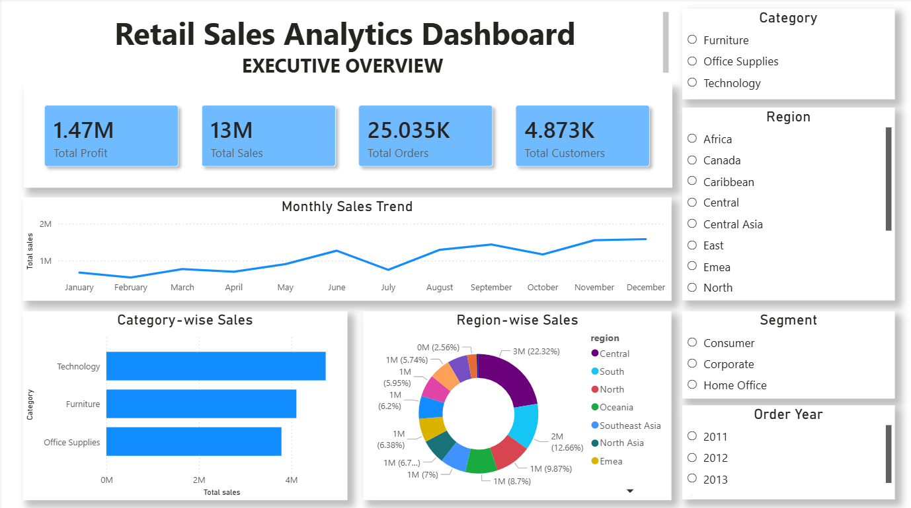
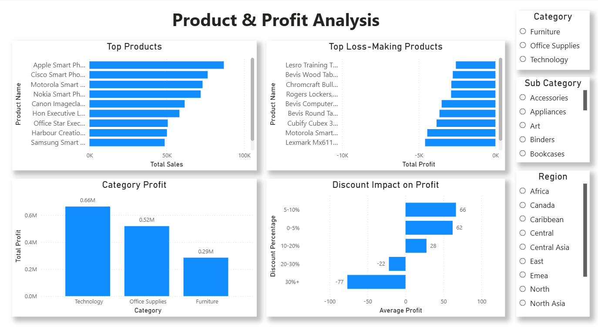
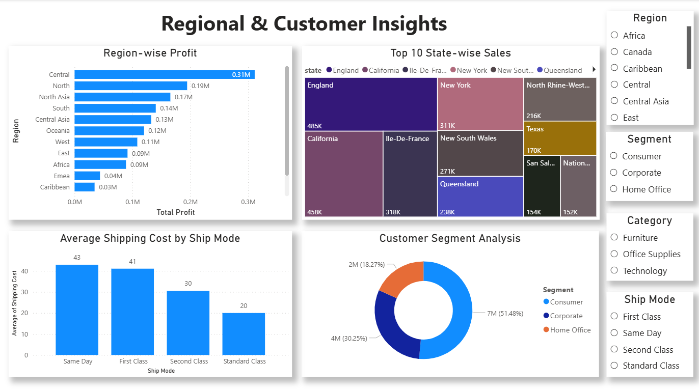

# Retail Sales Analytics & Business Intelligence Dashboard

## Project Overview

This project is an end-to-end Retail Sales Analytics and Business Intelligence solution developed using Python, SQL, Excel, and Power BI. The objective of this project is to analyze retail sales transactions, identify business trends, evaluate product and regional performance, and create interactive dashboards for data-driven decision making.

The project demonstrates the complete analytics workflow including:
- Data Cleaning
- Exploratory Data Analysis (EDA)
- SQL-based Business Analysis
- KPI Generation
- Dashboard Development
- Business Insights & Visualization

---

# Business Problem

Retail businesses generate large amounts of transactional data every day. Without proper analytics, it becomes difficult to:

- Identify profitable products
- Understand customer purchasing behavior
- Track sales trends
- Monitor regional performance
- Analyze the impact of discounts on profit
- Improve operational and business decisions

This project aims to solve these challenges by building a comprehensive analytics dashboard that transforms raw retail data into meaningful business insights.

---

# Dataset Information

Dataset Used:
- Superstore Sales Analytics Dataset 2026

Dataset Source:
- Kaggle

Dataset contains:
- 50,000+ retail transactions
- Customer information
- Product categories
- Regional sales data
- Shipping details
- Discounts and profit metrics

Key Columns:
- Order ID
- Order Date
- Customer Name
- Product Name
- Category
- Sub-Category
- Region
- Sales
- Profit
- Discount
- Shipping Cost
- Segment

---

# Tools & Technologies Used

| Tool / Technology | Purpose |
|---|---|
| Python | Data cleaning and analysis |
| Pandas | Data manipulation |
| NumPy | Numerical operations |
| SQL (MySQL) | Data querying and business analysis |
| Power BI | Interactive dashboard development |
| Excel | Initial data exploration |
| Jupyter Notebook | Data analysis workflow |
| GitHub | Version control and project hosting |

---

# Project Workflow

## 1. Data Cleaning & Preprocessing

Performed using Python (Pandas & NumPy):

- Removed duplicate records
- Converted date columns to datetime format
- Handled missing/infinite values
- Created derived columns:
  - Profit Margin
  - Year-Month
- Validated data consistency

---

## 2. Exploratory Data Analysis (EDA)

Performed analysis on:

- Sales trends
- Profit distribution
- Category performance
- Regional performance
- Segment analysis
- Discount impact
- Top-selling products
- Loss-making products

Visualizations were created using:
- Matplotlib
- Seaborn

---

## 3. SQL Analytics

Business queries were written in MySQL to analyze:

- Total sales and profit
- Category-wise performance
- Region-wise sales
- Monthly sales trends
- Customer analysis
- Shipping mode analysis
- Discount impact on profitability

Sample SQL Query:

```sql
SELECT
    category,
    ROUND(SUM(sales), 2) AS total_sales,
    ROUND(SUM(profit), 2) AS total_profit
FROM superstore_sales
GROUP BY category
ORDER BY total_profit DESC;
```

---

# Power BI Dashboard

A multi-page interactive dashboard was developed in Power BI.

## Dashboard Pages

### 1. Executive Overview

Includes:
- Total Sales KPI
- Total Profit KPI
- Total Orders KPI
- Total Customers KPI
- Monthly Sales Trend
- Category-wise Sales
- Region-wise Sales
- Interactive Filters

---

### 2. Product & Profit Analysis

Includes:
- Top 10 Products by Sales
- Top Loss-Making Products
- Category Profit Analysis
- Discount Impact on Profit
- Product-level Insights

---

### 3. Regional & Customer Insights

Includes:
- Region-wise Profit Analysis
- Customer Segment Analysis
- State-wise Sales Distribution
- Shipping Cost Analysis
- Interactive Slicers

---

# Key Business Insights

## 1. Technology Category Generates Highest Profit

Technology products contributed the highest sales and profit among all categories.

---

## 2. Consumer Segment Generates Maximum Revenue

The Consumer segment accounted for the largest share of total sales.

---

## 3. High Discounts Reduce Profitability

Products with discounts greater than 20% showed negative average profit.

---

## 4. Some Furniture Products Cause Significant Losses

Several furniture products consistently generated negative profit margins.

---

## 5. Central Region Shows Strongest Performance

The Central region contributed the highest sales and profit among all regions.

---

# Dashboard Screenshots

## Executive Overview



---

## Product & Profit Analysis



---

## Regional & Customer Insights



---

# Folder Structure

```text
Retail-Sales-Analytics-Dashboard/
│
├── dataset/
│   ├── superstore_sample_100rows.csv
│   └── data_dictionary.csv
│
├── notebooks/
│   └── retail_sales_analysis.ipynb
│
├── sql/
│   ├── retail_sales_queries.sql
│   └── query_outputs/
│
├── dashboard/
│   └── retail_sales_dashboard.pbix
│
├── screenshots/
│   ├── dashboard/
│   └── sql_outputs/
│
└── README.md
```

---

# Skills Demonstrated

This project demonstrates:

- Data Cleaning
- Data Analysis
- SQL Querying
- Data Visualization
- Business Intelligence
- Dashboard Design
- Analytical Thinking
- Business Storytelling
- KPI Reporting
- Attention to Detail

---

# Future Improvements

Potential future enhancements:

- Sales forecasting using Machine Learning
- Customer segmentation using clustering
- Real-time dashboard integration
- Streamlit web application deployment
- Predictive analytics for profit estimation

---

# Resume Highlights

- Developed an end-to-end Retail Sales Analytics Dashboard using Python, SQL, Excel, and Power BI to analyze 50K+ retail transactions.

- Designed interactive multi-page dashboards for sales trends, regional performance, customer segmentation, and profitability analysis.

- Performed SQL-based business analysis and identified key insights including discount impact on profit and top-performing product categories.

---

# Author

Ankur Sen

- LinkedIn: https://www.linkedin.com/in/ankur-sen-347879338/
- GitHub: https://github.com/senankur2005-spec

---

# License

This project is for educational and portfolio purposes.
